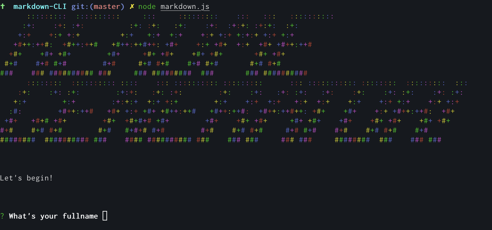

# README Generator CLI

### Table of contents

* [Tech stack](#tech-stack)
* [Preview](#preview)
* [Deployment](#deployment)
* [Installation and Usage](#installation-and-usage)
* [Testing](#testing)
* [Contributors and Contact](#contributors-and-contact)
* [License](#license)

A Node based readme generator to easily create a readme.md file for your next project!


## Tech Stack
node,inquirerjs


## Preview




## Installation and Usage

```npm install```

```npm start```

## Contact


**Email questions: [zappone.josh@gmail.com](mailto:zappone.josh@gmail.com)**

### License

MIT

